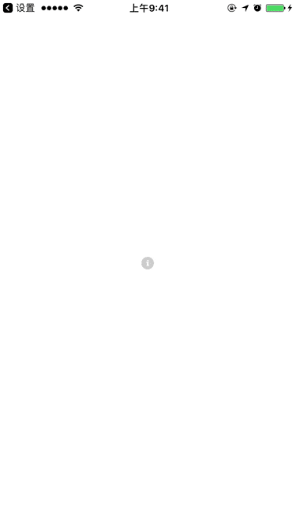

# ENMaskedPopOver
A lightweight PopOver view.

一个轻量级的文本弹出信息视图

## Demo Time



## Requirement

iOS 7+

## Usage

``` Objective-C
// in ViewController.m
[ENMaskedPopOver showPopOverText:@"这是一个独立的提示信息view，只需要一句话就可以完成整个事情" 
                 attributes:@{NSFontAttributeName: [UIFont systemFontOfSize:12], NSForegroundColorAttributeName: [UIColor blackColor]} 
                 inView:self.view 
                 basedOn:sender];
```

### Parameters

* inView : The view this masked-popover gonna show.
* basedOn : The view should be frame of reference to this masked-popover. 

note: `inView` could be other view. For example, if you want to cover the navigation bar, which I dont't like this approach, you just use it like this:

``` Objective-C
// in ViewController.m
[ENMaskedPopOver showPopOverText:@"这是一个独立的提示信息view，只需要一句话就可以完成整个事情" 
                 attributes:@{NSFontAttributeName: [UIFont systemFontOfSize:12], NSForegroundColorAttributeName: [UIColor blackColor]} 
                 inView:[[UIApplication sharedApplication].windows firstObject] 
                 basedOn:sender];
``` 

---

## 系统要求

iOS 7+

## 使用方法

``` Objective-C
// in ViewController.m
[ENMaskedPopOver showPopOverText:@"这是一个独立的提示信息view，只需要一句话就可以完成整个事情" 
                 attributes:@{NSFontAttributeName: [UIFont systemFontOfSize:12], NSForegroundColorAttributeName: [UIColor blackColor]} 
                 inView:self.view 
                 basedOn:sender];
```

### 参数

* inView : 文本弹出层的遮罩在哪个view中
* basedOn : 文本弹出层应该以哪个view座位计算的参考view 

注意: `inView` 这个参数可以是其他的view。比如说, 如果你想弹出层能够遮住navigationbar（我个人很不喜欢这种交互），你可以这样做:

``` Objective-C
// in ViewController.m
[ENMaskedPopOver showPopOverText:@"这是一个独立的提示信息view，只需要一句话就可以完成整个事情" 
                 attributes:@{NSFontAttributeName: [UIFont systemFontOfSize:12], NSForegroundColorAttributeName: [UIColor blackColor]} 
                 inView:[[UIApplication sharedApplication].windows firstObject] 
                 basedOn:sender];
``` 